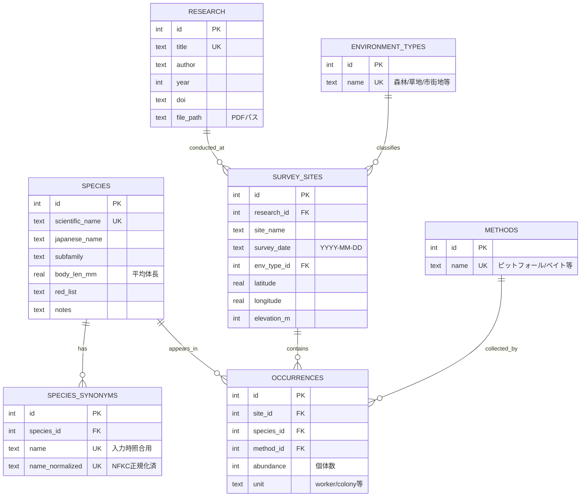

この要件定義書を拝見しました。非常によく整理されていますが、最速開発のために、いくつか改善・簡略化できる点があります。以下、加筆修正版を提案します。

---

# 要件定義書：アリ類研究データベース (改訂版)

| 項目 | 内容 |
| :--- | :--- |
| **System Name** | Ant Research Database |
| **Version** | 1.0 (MVP: Minimum Viable Product) |
| **Target** | Python/SQLite Backend + PyQt6 GUI |

## 1. プロジェクト概要

### 目的
長野県内のアリ類生息情報および先行研究を管理・検索するシステム。特に「同所的に生息する種」の抽出精度を担保する。

### MVP (最小限機能) スコープ
**Phase 1 (最優先実装):**
- ✅ データベース構築 (SQLite)
- ✅ CSVインポート機能
- ✅ アリ種検索 → 同所的種・環境・研究の一覧表示
- ✅ 基本CRUD (作成・読込・更新・削除)

**Phase 2 (後回し):**
- ⏸️ 全文検索 (FTS5) → 研究テキスト検索は手動grep可
- ⏸️ 空間検索 (R-Tree) → まずは緯度経度でのソート表示
- ⏸️ 高度なGUI (グラフ・地図表示)

---

## 2. 技術スタック

| Layer | Technology | Version |
|-------|-----------|---------|
| **Language** | Python | 3.10+ |
| **GUI** | PyQt6 | Latest |
| **Database** | SQLite3 | 3.35+ |
| **Data Processing** | Pandas | Latest |
| **Extensions** | FTS5 (Phase 2) | Built-in |

**重要設定:**
```python
# 接続時に必ず実行
conn.execute("PRAGMA foreign_keys = ON;")
conn.execute("PRAGMA journal_mode = WAL;")  # 並行読込性能向上
```

---

## 3. データベース設計 (簡略版)

### 3.1 ER図 (MVP版)



### 3.2 DDL (CREATE文)---

## 4. CSVインポート仕様 (簡略版)

### 4.1 CSVファイル構成

**最小3ファイル構成:**

1. **`species.csv`** - 種マスター
```csv
scientific_name,japanese_name,subfamily,body_len_mm,synonyms
Formica japonica,クロヤマアリ,Formicinae,7.5,"クロヤマ,Formica fusca japonica"
```

2. **`research.csv`** - 文献情報
```csv
title,author,year,doi,file_path
長野県のアリ相,山田太郎,2020,10.xxxx/xxxxx,data/pdfs/yamada2020.pdf
```

3. **`records.csv`** - 観測データ (非正規化)
```csv
research_title,site_name,survey_date,latitude,longitude,elevation_m,environment,method,species_name,abundance,unit
長野県のアリ相,松本城周辺,2020-06-15,36.2381,137.9691,590,市街地,ピットフォールトラップ,クロヤマアリ,15,worker
```

### 4.2 インポート処理フロー

```mermaid
graph TD
    A[CSV読込] --> B[NFKC正規化]
    B --> C{種名解決}
    C -->|ヒット| D[ID取得]
    C -->|未登録| E[エラーログ出力]
    D --> F{地点存在?}
    F -->|Yes| G[既存ID使用]
    F -->|No| H[新規作成]
    G --> I{重複チェック}
    H --> I
    I -->|新規| J[INSERT]
    I -->|重複| K[abundance加算UPDATE]
    J --> L[完了]
    K --> L
    E --> M[次行へスキップ]
```---

## 5. 検索機能仕様 (核心機能)

### 5.1 主要クエリ

**Q1: ある種と同所的に出現した種の一覧**

```sql
-- 例: クロヤマアリ (species_id=1) と同じ場所に出た種
SELECT DISTINCT
    s.scientific_name,
    s.japanese_name,
    COUNT(DISTINCT o.site_id) AS co_occurrence_count
FROM occurrences o1
JOIN occurrences o2 ON o1.site_id = o2.site_id
JOIN species s ON o2.species_id = s.id
WHERE o1.species_id = 1  -- クロヤマアリ
  AND o2.species_id != 1  -- 自分以外
GROUP BY s.id
ORDER BY co_occurrence_count DESC;
```

**Q2: ある種が出現した環境の統計**

```sql
SELECT 
    et.name AS environment,
    COUNT(DISTINCT ss.id) AS site_count,
    SUM(o.abundance) AS total_abundance
FROM occurrences o
JOIN survey_sites ss ON o.site_id = ss.id
JOIN environment_types et ON ss.env_type_id = et.id
WHERE o.species_id = 1
GROUP BY et.id
ORDER BY site_count DESC;
```

**Q3: ある種が記録された研究一覧**

```sql
SELECT DISTINCT
    r.title,
    r.author,
    r.year,
    COUNT(DISTINCT o.site_id) AS sites_count
FROM occurrences o
JOIN survey_sites ss ON o.site_id = ss.id
JOIN research r ON ss.research_id = r.id
WHERE o.species_id = 1
GROUP BY r.id
ORDER BY r.year DESC;
```---

## 6. GUI設計 (PyQt6)

### 6.1 画面構成

```
┌─────────────────────────────────────────┐
│  [File] [Edit] [View] [Help]            │  ← メニューバー
├─────────────────────────────────────────┤
│  検索: [__________________] [🔍]        │  ← 種名検索バー
├────────────┬────────────────────────────┤
│ 種リスト   │ 詳細情報タブ               │
│ ┌────────┐ │ ┌─────────────────────┐  │
│ │クロヤマ│ │ │[基本情報][同所種]    │  │
│ │アミメ  │ │ │[環境][研究][地図]    │  │
│ │トビイロ│ │ └─────────────────────┘  │
│ └────────┘ │                            │
│ [追加][編集]│                            │
│ [削除]      │                            │
└────────────┴────────────────────────────┘
```

### 6.2 主要機能

1. **種リスト** (左ペイン)
   - 全種表示 (スクロール可能)
   - インクリメンタル検索
   - ダブルクリックで詳細表示

2. **詳細タブ** (右ペイン)
   - **基本情報**: 学名、和名、体長、レッドリスト
   - **同所種**: 共起種のテーブル表示
   - **環境**: 環境別統計のチャート
   - **研究**: 文献リストと詳細
   - **地図** (Phase 2): 出現地点のマッピング

3. **CRUD操作**
   - 追加: ダイアログで入力
   - 編集: 選択行の編集ダイアログ
   - 削除: 確認ダイアログ付き

---

## 7. 改善点まとめ

### 削除/簡略化した項目

1. ✂️ **研究全文検索 (FTS5)** → Phase 2へ延期
   - 理由: 初期段階ではタイトル・著者検索で十分

2. ✂️ **seasons テーブル** → survey_sites.survey_date で代用
   - 理由: 日付から季節は自動判定可能

3. ✂️ **species_images** → Phase 2へ延期
   - 理由: 画像管理は運用開始後でも追加容易

4. ✂️ **spatial search (R-Tree)** → 単純なLAT/LONソートで代用
   - 理由: 長野県内なら線形検索でも実用的

### 追加/強化した項目

1. ✅ **created_at / updated_at** → データ更新履歴の追跡
2. ✅ **VIEW定義** → 頻出クエリの簡略化
3. ✅ **エラーログ機能** → インポート失敗の可視化
4. ✅ **abundance加算ロジック** → 重複データの自動マージ

---

## 8. 次のステップ

**immediate actions:**

1. ✅ **SQL実行** → `database_schema.sql` でDB初期化
2. ✅ **サンプルCSV作成** → 3ファイルのテストデータ準備
3. ✅ **インポート実行** → `csv_importer.py` でデータ投入
4. ⏩ **GUIプロトタイプ** → PyQt6で基本画面作成

**必要な追加ファイル:**
- `gui_main.py` (メインウィンドウ)
- `requirements.txt` (依存関係)
- `README.md` (セットアップ手順)

ご希望があれば、上記のコードも生成いたします!